# Getting Started Guide

## Table of Contents
- [Overview](#overview)
- [Purpose of the Platform](#purpose-of-the-platform)
- [Flow of the Platform](#flow-of-the-platform)
  - [Planning](#planning)
  - [Order](#order)
  - [Distribution](#distribution)
  - [Disposal](#disposal)
- [Target Audience](#target-audience)
  - [Who is it for?](#who-is-it-for-?)
  - [What does it do?](#what-does-it-do-?)
  - [Why use it?](#why-use-it-?)
- [Service](#service)
- [Platform Availability](#platform-availability)
  - [Web Platform](#web-platform)
  - [Mobile Platform](#mobile-platform)
- [Accessing the Platform](#accessing-the-platform)
  - [Minimum System Requirements](#minimum-system-requirements)
  - [Logging In](#logging-in)
- [Navigating the Platform](#navigating-the-platform)
  - [Web Platform](#web-platform)
  - [Mobile Platform](#mobile-platform)
- [Documentation Overview](#document-overview)
- [Using Core Feature](#using-core-feature)
  - [View Stock](#how-to-view-stock-on-an-entity)
  - [Order](#how-to-view-the-order-list-and-create-order)
  - [Distribution](#how-to-view-the-order-list-and-create-distribution)
  - [Discard](#how-to-view-the-transaction-list-and-create-discard-transaction)
  - [Last Mile](#how-to-view-the-transaction-list-and-create-last-mile-transaction)
- [Next Step](#next-step)
  
---

## Overview – Introduction to SMILE Health

The Electronic Health Inventory and Logistics Monitoring System (SMILE) was initially developed to support vaccine distribution and logistics for routine immunization programmes in Indonesia. As a digital solution, SMILE streamlines national health logistics systems to ensure the availability and equitable distribution of vaccines and medicines across the country.

The effectiveness of SMILE was clearly demonstrated during the COVID-19 pandemic, when the system enabled the rapid distribution of hundreds of millions of vaccine doses to regions nationwide, significantly strengthening Indonesia’s response to the health crisis.

Beyond immunization, SMILE has expanded to support additional health programmes. In March 2024, SMILE was piloted for the rabies programme in East Nusa Tenggara (NTT) and subsequently scaled nationwide starting in August 2024. Today, the platform supports multiple health commodities, including those for tuberculosis, HIV, malaria, rabies, and medical waste management.

Currently, SMILE manages more than 800 million vaccine doses and 100 million medicine doses across over 10,000 healthcare facilities in 38 provinces in Indonesia. The system provides end-to-end visibility across the health supply chain, from storage and inventory management to distribution and reporting.

In 2022, an economic impact study demonstrated the significant value generated by SMILE. With an investment of USD 20 million, the system produced an estimated return of nearly USD 60 million, equivalent to 2.77 times the initial investment for the immunization programme alone. SMILE also prevents potential losses due to temperature excursions, estimated at up to USD 32,600 per month per healthcare facility, highlighting the critical role of real-time cold chain monitoring. The study further provides guidance for digital transformation across other health programmes, including financing through local and national budgets.

SMILE delivers the following key capabilities:
- Monitors vaccine and medicine storage temperatures
- Manages vaccine and medicine inventory accurately
- Supports distribution to remote and hard-to-reach areas
- Automatically generates periodic reports
- Records comprehensive storage and logistics data

SMILE has now become a national health logistics management model with a positive impact not only on the health sector but also on the broader economy, improving efficiency, transparency, and accountability across multiple levels of government.

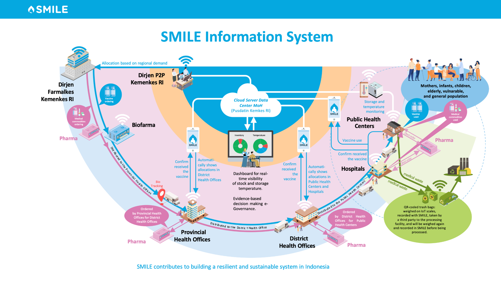

_If you would like to access the SMILE source code, please contact smilehealth.undp@gmail.com_

---

## Purpose of the Platform

This application’s digital innovation includes a mobile application for cold chain handlers, a web interface 
that receives data from the app, a temperature logger to track vaccine storage temperatures, and a vaccine and 
cold chain manager to ensure that the product and procedures run smoothly. Health officials can use the analytics 
on the SMILE web interface to verify whether vaccinations are overstocked, falling short of the prescribed amounts,
or entirely out of stock. This facilitates governance and program management by making data available from even 
the most remote sites.

SMILE enhances operational efficiencies, lowers costs for government health providers, and addresses disparities 
in vaccine coverage. It integrates advanced technology, systematic record-keeping practices, and a network of trained 
personnel to aid health officials in tackling widespread inequities in vaccine distribution. By overcoming challenges 
related to infrastructure, monitoring and management information systems, and human resource constraints—which often lead 
to overstocking and stock-outs in storage facilities—SMILE supports evidence-based public health decisions by providing 
data freely to policymakers and decision-makers.

---

## Sustainable Development Goals (SDG) Alignment

SMILE contributes to multiple Sustainable Development Goals by strengthening national health logistics systems and digital public infrastructure.

Detailed SDG alignment is available here:
- [SDG Alignment – SMILE](SDG_ALIGNMENT.md)

## Flow The Platform
This application’s have 4 main flow that support its use of the application for vaccine and medicine logistics. 
This main flow is Planning, Order, Distribution, and Disposal.

### Planning

The **Flow of Planning** for medicines, medical devices, and other health supplies through the SMILE system begins at 
the Regency/Municipal Health Office, which **prepares a needs planning that the needs proposed** by Community Health Centers 
and Hospitals. This planning data is then submitted to the Provincial Health Office for review and consolidation. 
After the Provincial Health Office completes its review, the consolidated planning is submitted to the Ministry of Health of the Republic of Indonesia.

At the national level, the Ministry of Health conducts a **desk verification** of the planning together with each Provincial Health Office.
This verification includes planning for medicines and logistics using the e-monev system. Once the verification process is completed, 
confirmation is provided, and all planning data is recorded in the SMILE system to ensure accuracy, transparency, and accountability.

### Order

The **Flow of Ordering** medicines, medical devices, and other health supplies through the SMILE system begins at healthcare 
facilities such as Community Health Centers and Hospitals, which submit their **orders through the system**. These orders are
then forwarded to the Regency/Municipal Health Office for further **processing and confirms** the details, including quantity, 
batch number, and expiration date with **allocation order**. Subsequently, the orders are sent to the Provincial Health Office 
for verification and confirms with allocation order. After this step, the Provincial Health Office submits the orders to 
the Ministry of Health of the Republic of Indonesia. Once the orders are received, the Ministry of Health confirms and allocation order. 

After confirmation, Order is carried out according to the data recorded in the SMILE system. All ordering and 
distribution data are recorded in the SMILE system to ensure transparency, accuracy, and traceability.

### Distribution

The **Flow of Distribution** through the SMILE system begins when the Ministry of Health of the Republic of Indonesia to a **distribution order** to the 
**manufacturer or distributor**. The manufacturer or distributor then carries out the distribution of medicines, vaccines, and other logistics 
according to the order. Material data from the distribution process is **recorded in the DIN system and integrated with SMILE based on the KFA**.

Once the distribution is initiated, the Provincial Health Office **receives the supplies and records the distribution data** in SMILE. 
After confirmation, the supplies are further distributed to the Regency/Municipal Health Office, which also records the distribution data in SMILE. 
Finally, the supplies reach the Community Health Centers and Hospitals, where confirmation is provided regarding the quantity, 
batch number, and expiration date.

Throughout the process, all distribution data is documented in SMILE to ensure transparency, accuracy, and traceability. Additionally, 
SMILE tracks the amount of logistics and vaccines used, relocated, and those that have expired or been damaged.

### Disposal

The **Flow of Disposal** begins with the Ministry of Health of the Republic of Indonesia issuing a **distribution order to manufacturers and distributors**. 
Upon receiving the order, manufacturers and distributors distribute medicines, vaccines, and other health logistics as instructed, while recording 
material data based on the DIN system, which is integrated into the SMILE system.

Next, the distribution proceeds in stages. First, the items are delivered to the Provincial Health Office, then to the Regency/Municipal Health Office, 
and finally to community health centers and hospitals. At each stage, **distribution data is documented and recorded in the SMILE** system through 
SMILE Distribution Data.

Once the items reach health facilities, **documenting is carried out for medicines, vaccines, and logistics that cannot be used**. The recorded 
information includes quantity, batch number, and expiration date. This data is then entered into the SMILE system to ensure transparency. 
The SMILE system also records items that cannot be used and have been handed over to a third party for disposal.

---

## Target Audience
### Who is it for?
Health facility and Program managers at the public health centre, hospital, district, province, and national levels, as well as staff from Biofarma, as a vendor.

### What does it do?
Ensures proper storage and distribution of health service materials by tracking temperatures, monitoring stock levels, and providing real-time data information.

### Why use it? 
The benefits of SMILE include the following:
1. Informs policy and decision-making for immunisation supply chain management at all levels;
2. Develops standard operating procedures for systematic record-keeping of vaccine logistics to minimise human error in recording;
3. Facilitates maintenance of optimum vaccine stocks by reducing instances of vaccine wastage and stock-out;
4. Supervision and Minimisation of Excess Vaccine Stock;
5. Ensures quality and safety of vaccines through real-time information on storage temperature with the help of SIM-enabled temperature loggers;
6. Improves the efficiency of vaccine cold chain logistics management by introducing state-of-the-art technology for digitising vaccine stocks;
7. Strengthens the immunization system by empowering the human resources in districts

---

## Service
| **Service** | **Description** |
|------|------------------------|
| **Inventory** | Monitor stock levels, update product availability, and track supply chain logistics. |
| **Order** | Track and create stock movements by requesting or distributing it to other entity. |
| **Transaction** | Manage and record all stock movements while ensuring accurate inventory updates. |
| **Warehouse Inspection** | Ensuring alignment between stock movements and transactions recorded in the application with what actually happens. |
| **Asset** | Manage the assets owned by entities in the application to ensure stock quality and capacity are well monitored. |
| **Dashboard and Report** | View summarized information from the data stored in the application to support decision-making and for audit purposes. |
| **Disposal** | Manage and record disposal transaction in the application to process discard material by self or disposal instruction. |
| **Planning** | Manage and record annual planning stock material for distribution to entity  |

---

## Platform Availability
SMILE is accessible on both web and mobile platforms, and also on the API synchronisation with other external 
health care system with restricted access providing a seamless experience across devices. Accessing the platform 
can be differ by the role you are assigned to. For more information about the role that can access each platform, 
please refer to Role and Responsibilities page.
- **Web Platform**: Access the platform via a supported browser on Windows, macOS, or Linux;
- **Mobile Application**: Available for Android and iOS, ensuring accessibility on the go;
- **Synchronisation**: All data and functionality are consistent across web and mobile, allowing users to switch between devices effortlessly.

### Web Platform
You can directly use the application through your web browser by accessing the link below.
link : https://smile.kemkes.go.id/id/v5/login

### Mobile Platform
You need to download the application into your mobile device to use the application.

- **Android**
  - link : [SMILE Health - Apps on Google Play](https://play.google.com/store/apps/details?id=com.smilemonitor&hl=en_US) 

- **iOS**
  - link : [SMILE Health App - App Store](https://apps.apple.com/id/app/smile-health/id1616828204?l=id) 

---

## Accessing the Platform
### Minimum System Requirements
- Supported Browsers for Web Platform: 
   - Chrome 131.x;
   - Firefox 133.x;
   - Edge 133.x;
   - Safari 18.x.
- Mobile Compatibility for Mobile Application:
   - Android 10.x;
   - iOS 13.x.

### Logging In
#### Web Workflow
You can access the SMILE Platform through the link https://smile.kemkes.go.id/ in your browser. 
1. Open the SMILE 5.0 login page;
2. Fill in the credentials in the Username and Password field;
   

4. Click Login - this will display the program page that has been assigned and show a pop-up
message Login successful. Redirecting to the homepage.

#### Mobile Workflow
You can access the app by downloading it at Play Store for Android or App Stor for iOS.
1. Open the SMILE app on the mobile device –  this will navigate to the login page;
2. Fill in the credentials in the Username and Password field;

3. Click Login - this will display the program page that has been assigned and show a pop-up
   message Login successful.
   

---

## Navgiating the Platform
### Web Application
#### Home Page
After logging in, you will see the **SMILE Programs**, which provide access to the 
programs that have been assigned to you.

#### Global Navbar Overview
On top of the screen, you will see the Navbar, which provides quick access to:
1. **Sidebar**: This sidebar contains another access to the assigned programs for the current user;
2. **Logos**: Contains the logo of SMILE Application, Ministry of Health Indonesia, and UNDP Indonesia;
3. **Entity Name**: Provides information about the current user’s associated entity;
4. **Asset Management**: A management of asset owned by entity;
5. **SMILE E-Learning**: A learning platform with video courses to help users understand how to use
   SMILE and manage their programs. It's mainly used during training sessions;
6. **Export History**: A place to view and download export data files that have been requested by the current user.
7. **Notification**: Contains information related to changes that occur in inventory, orders, or transactions
   on the user’s associated entity;
8. **Language**: The Languages option is provided for users to use SMILE;
9. **Profile**: A dropdown for the user to perform profile-related actions, such as View Profile and Logout.

For Super Admin, there is also a **Global Setting** action menu in this dropdown.

#### Sidebar Overview
Once you click the Dotted-box icon on the top left of the screen, it will be shown the list 
of programs that have been assigned to you.

## Mobile Application
### Homepage
After logging in, you will see the SMILE Programs, which provide access to the programs 
that have been assigned to you.

### Navbar Overview
On top of the screen, you will see the Navbar, which provides quick access to:
1. Notification: Contains information related to changes that occur in inventory,
   orders, or transactions on the user’s associated entity;
2. Profile Sidebar: This sidebar contains the current profile’s related information
   and other actions, iconed with current profile’s initial full name.
3. User’s Entity Information: Information about the current user’s profile associated entity;

On bottom of the screen, you will see the Navbar, which provides quick access to:
1. Asset Management: Manage the assets owned by entities in the application to ensure stock quality and capacity are well monitored.

### Sidebar Overview
Once you click the Profile icon on the top right of the screen, it will be shown the profile-related information including:
1. **Profile Management**: Contain actions related to Profile Management, such as Edit Profile and Edit Password;
2. **Language**: A language option is provided for users to use SMILE;
3. **Application’s Version**: Information about current’s version of the application used;
4. **Logout**: Logs out of the system.

---

## Documentation Overview
In this section, you can view a curated list of essential resources and documentation designed to enhance your 
understanding and utilization of the SMILE platform. Each entry offers valuable insights, detailed instructions, 
and updates that are crucial for both new and experienced users. Whether you are seeking specific programme details, 
technical specifications, or the latest changes, this list serves as a comprehensive guide for effectively 
navigating the various aspects of the platform.
- Ministry of Health Healthcare System Overview
- System Data Architecture
- Database Tables Overview
- Role and Responsibilities
- API Documentation
- SMILE Services
- Glossary
- SMILE User Guide
- API Quick Start Guide
- Error Codes and Troubleshooting Guide
- Technical Overview Guide
- SMILE Cloud Infrastructure
- Data Streaming Mechanism
- Deployment and Installation Guide

---

## Using Core Feature
### How to View Stock on an Entity

To perform this feature, follow these steps:
1. Log in to the SMILE system;
2. Select the desired Program;
3. Navigate to the **Analysis** menu - this will display the **Analysis** sub menu list;
4. Click the **Inventory** sub menu - this will display the Inventory List;
5. Click **Stock Detail** – this will display **Stock List**;
6. Apply the desired filter(s) –  this will filter the stock material list with applied filters;
7. Click **Search** –  this will display a list of stock material with the applied filters.

### How to View the Order List and Create Order
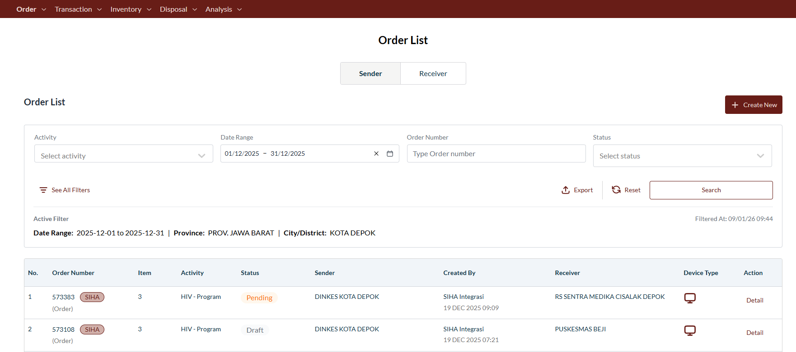
To perform this feature, follow these steps:
1. Log in to the SMILE system;
2. Select the desired Program with a hierarchical material configuration;
3. Navigate to the Order menu;
4. Click the Order submenu – this will display the list of Order Management features;
5. Click the Order – this will redirect you to Order List page and displays the list of order on selected program;
6. Apply the desired filters –  this will configure the filter to be applied to the Order List;
7. Click Search – this will display all order lists with the applied filters;
8. To view the detailed information about the order process status, click Detail on the desired order;
9. To create new order, click +Create New and select the desired order type.
10. Click Order - this will redirect user to Create New Order page;
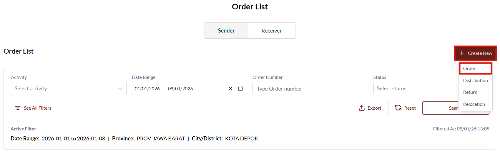
11. Fills in the Entity Name in Receiver field - this will display a list of entities for which will request the order.
12. Fills in the Entity Name in Sender field - this will display a list of entities that will fulfill the order;
13. Fills in the Activity field - this will display a list of active activity on the selected entity;
14. Fills in the Required Date field - this will display this will display date when order is required to be fulfilled;
15. Fills in the Comment field - this will display a free text field to additional information to related user such as selected Sender.
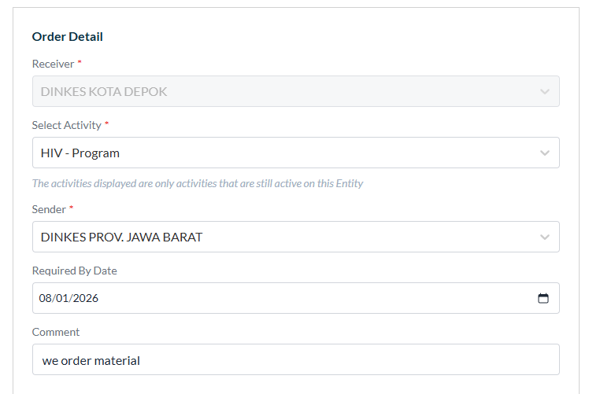
16. Select the desired material on the material section - the selected material will automatically added to Order Table.
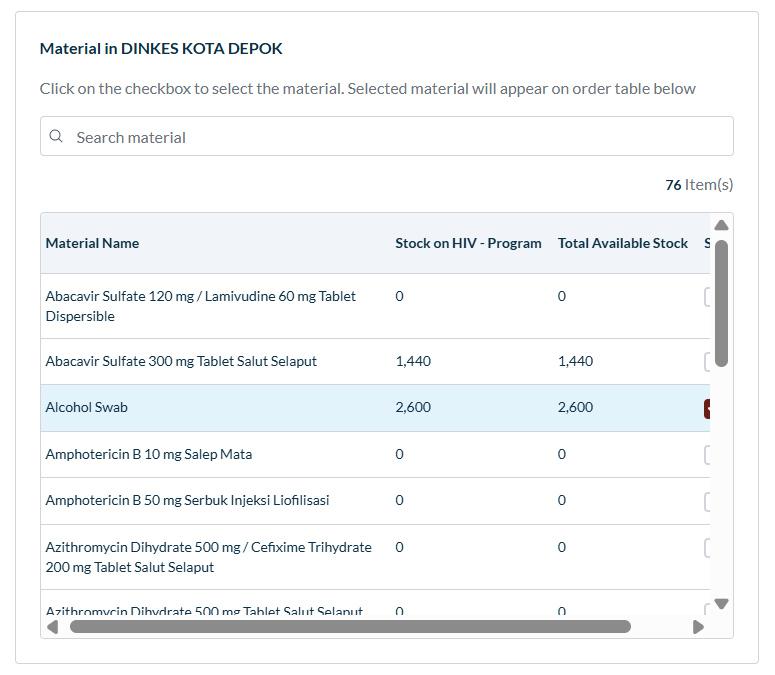
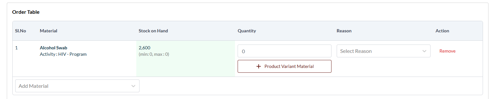
18. Fill in the Quantity field in the order table - this will display the recommended quantity of material on selected material;
19. Clicks Reason - this will display several reasons of the order.
20. Clicks Send button - this will display a pop-up confirmation;
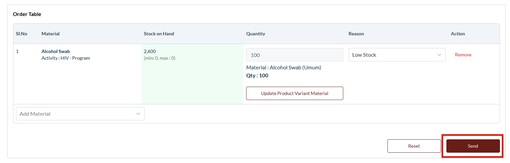
21. Clicks Yes button on pop-up confirmation - this will create new order.
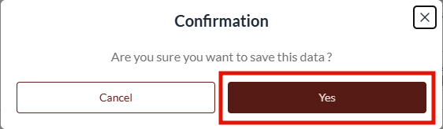

### How to View the Order List and Create Distribution

To perform this feature, follow these steps:
1. Log in to the SMILE system;
2. Select the desired Program with a hierarchical material configuration;
3. Navigate to the Order menu;
4. Click the Order submenu – this will display the list of Order Management features;
5. Click the Order – this will redirect you to Order List page and displays the list of order on selected program;
6. Apply the desired filters –  this will configure the filter to be applied to the Order List;
7. Click Search – this will display all order lists with the applied filters;
8. To view the detailed information about the order process status, click Detail on the desired order;
9. To create new order, click +Create New and select the desired order type.
10. Clicks Distribution - this will redirect you to Create New Distribution page;
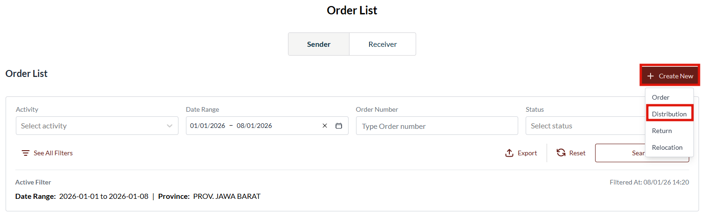
11. Fills in the Entity Name in Sender field - this will display a list of entities that will distribute the material
12. Fills in the Activity field - this will display a list of active activity on the selected entity.
13. Fills in the Entity Name in Receiver field - this will display a list of entities that will receive distribution order
14. Fills in the Required Date field - this will display date when order is required to be fulfilled.
15. Fills in the Comment field - this will display a free text field to additional information to related user such as selected Receiver.
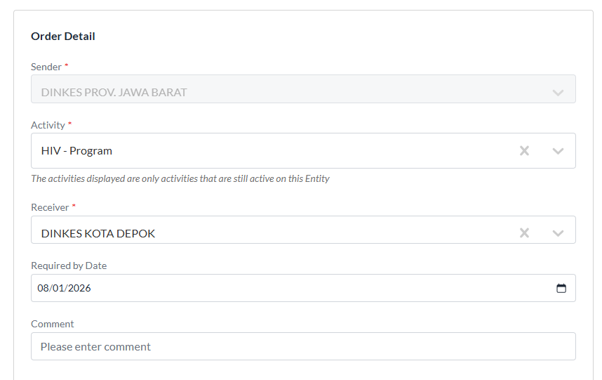
16. Select the desired material on the material section - the selected material will automatically added to Distribution Table.
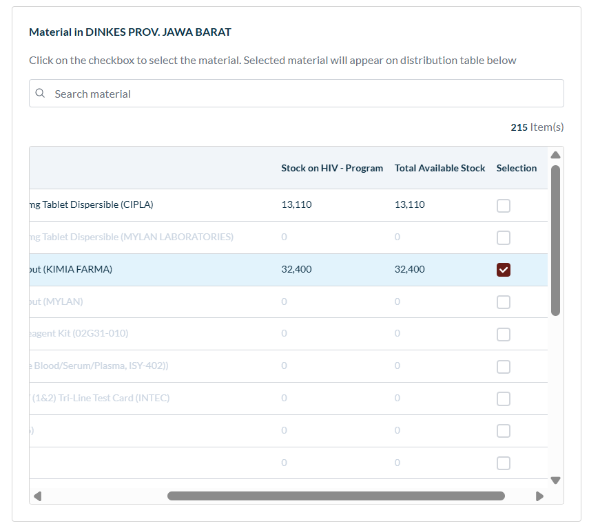
17. Click +Batch Quantity in Quantity field - this will display pop-up Batch List of selected material.

18. Fill in the Quantity field in the pop-up Batch List.
19. Click Save.
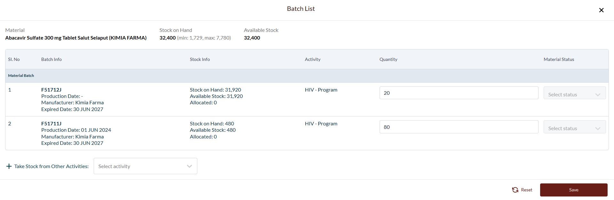
20. Clicks Save button - this will display a pop-up confirmation;
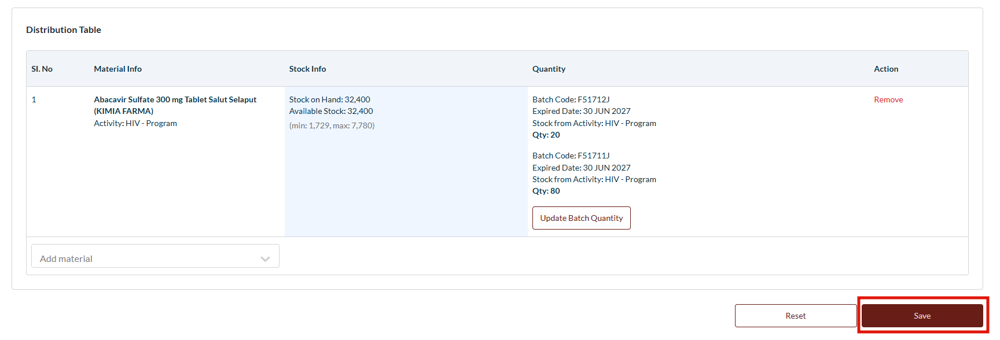
21. Clicks Yes button on pop-up confirmation - this will create new order.
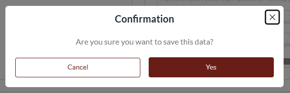

### How to View the Transaction List and Create Discard Transaction
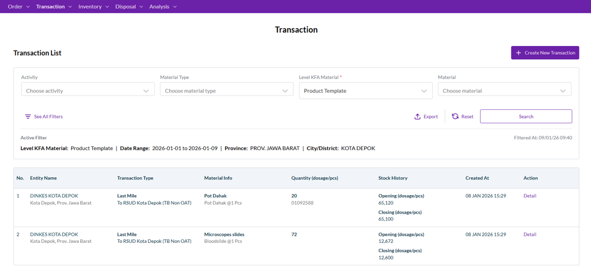
To perform this feature, follow these steps:
1. Log in to the SMILE system;
2. Select the desired Program with a hierarchical material configuration;
3. Navigate to the Transaction menu;
4. Click the Transaction List submenu this will redirect you to Transaction List page and displays the list of transaction on selected program;
5. Apply the desired filters –  this will configure the filter to be applied to the Transaction List;
6. Click Search – this will display all order lists with the applied filters;
7. To view the detailed information about the transaction, click Detail on the desired transaction;
8. To create new transaction, click +Create New Transaction and select the desired transaction type.
9. Clicks Discard Transaction - this will redirect you to Create Discard Transaction;
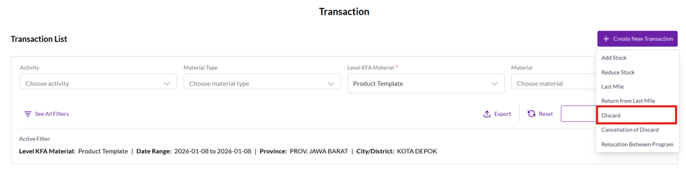
10. Fill in the required fields
11. Click on the desired material – this will add the material to Transaction Table;
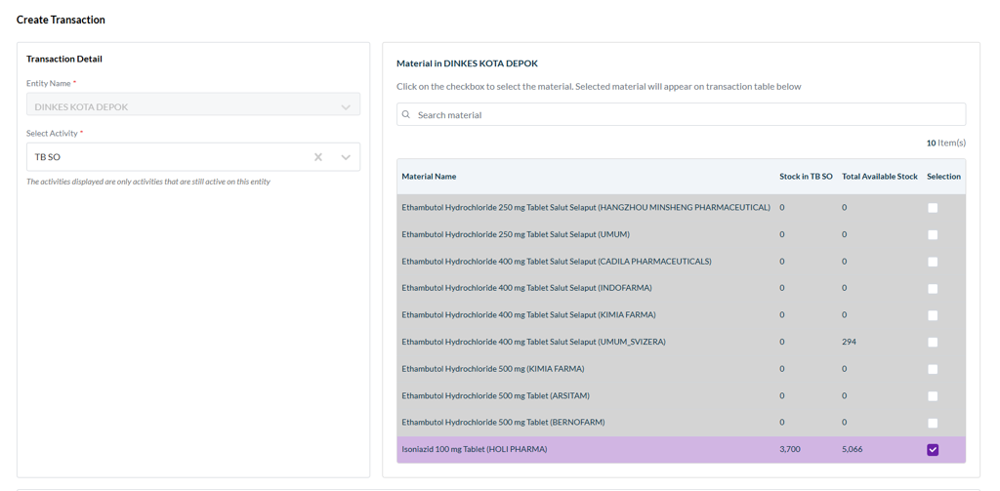
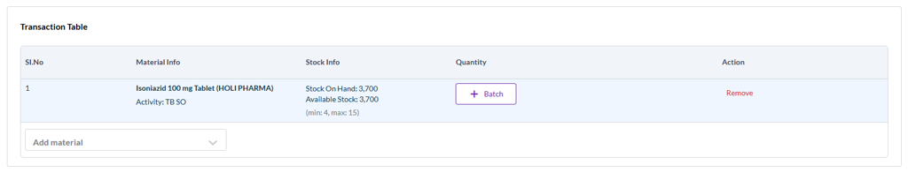
12. Clicks +Batch or +Detail on the desired material –  this will display pop up menu contains material details;
13. Fill in the required fields
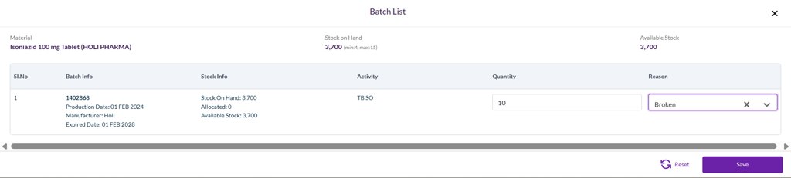
14. Clicks Send - this will create new transaction.

### How to View the Transaction List and Create Last Mile Transaction

To perform this feature, follow these steps:
1. Log in to the SMILE system;
2. Select the desired Program with a hierarchical material configuration;
3. Navigate to the Transaction menu;
4. Click the Transaction List submenu this will redirect you to Transaction List page and displays the list of transaction on selected program;
5. Apply the desired filters –  this will configure the filter to be applied to the Transaction List;
6. Click Search – this will display all order lists with the applied filters;
7. To view the detailed information about the transaction, click Detail on the desired transaction;
8. To create new transaction, click +Create New Transaction and select the desired transaction type.
9. Clicks Last Mile - this will redirect you to Create Last Mile Transaction;
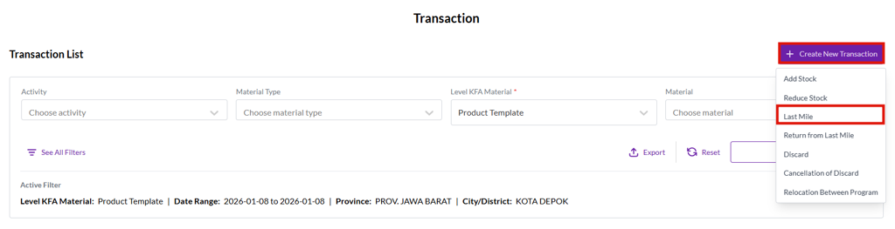
10. Fill in the required fields
11. Click on the desired material – this will add the material to Transaction Table;
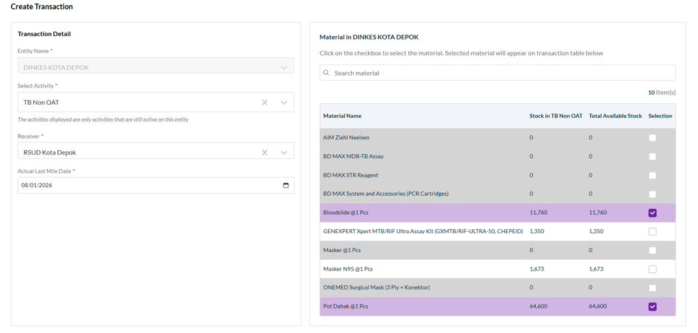
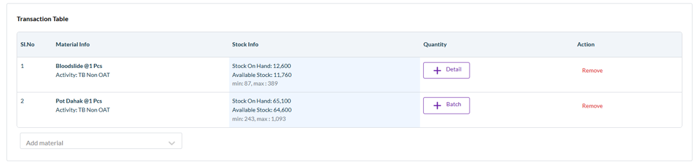
12. Clicks +Batch or +Detail on the desired material –  this will display pop up menu contains material details;

13. Fill in the required fields.
14. Click Save.
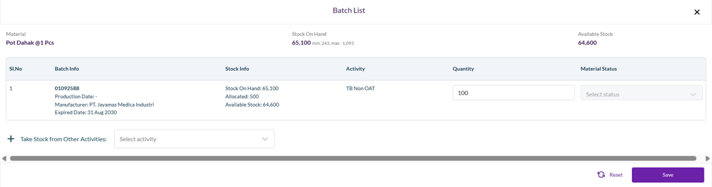
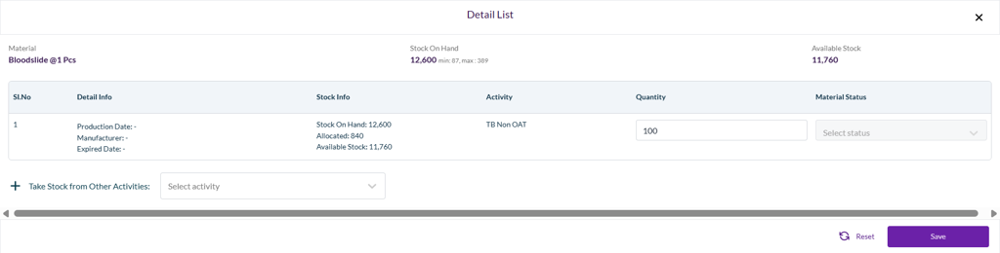
15. Clicks Send - this will create new transaction.
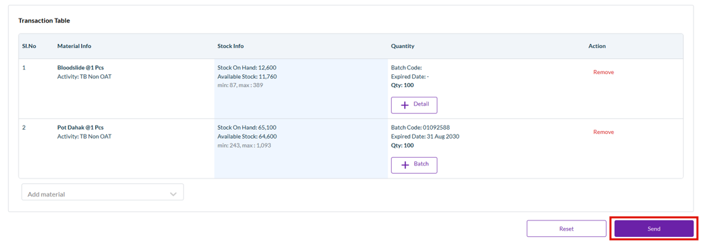

---

## Digital Public Good (DPG)

SMILE is developed as a Digital Public Good in alignment with the DPG Standard. It contributes to Sustainable Development Goals by strengthening public health supply chains, improving data-driven decision-making, and supporting equitable access to essential health services.

The project is:
- Open-source
- Platform-independent
- Designed with privacy, security, and do-no-harm principles

## Next Steps
- Explore the SMILE Knowledge Base to maximize your platform's potential;
- Go over each SMILE Services for in-depth instructions;
- Stay updated with the latest enhancements in our Changelog.
- If you would like to access the SMILE source code, please contact smilehealth.undp@gmail.com

## Digital Public Good (DPG)

SMILE is developed as a Digital Public Good in alignment with the DPG Standard. It contributes to Sustainable Development Goals by strengthening public health supply chains, improving data-driven decision-making, and supporting equitable access to essential health services.

The project is:
- Open-source under an OSI-approved license
- Designed to be deployable across multiple infrastructure environments
- Developed with consideration for privacy, security, and do-no-harm principles

