# Getting Started Guide

## Table of Contents
- [About](#about)
- [Purpose of the Platform](#purpose-of-the-platform)
- [Flow of the Platform](#flow-of-the-platform)
  - [Planning](#planning)
  - [Order](#order)
  - [Distribution](#distribution)
  - [Disposal](#disposal)
- [Target Audience](#target-audience)
  - [Who is it for?](#who-is-it-for-?)
  - [What does it do?](#what-does-it-do-?)
  - [Why use it?](#why-use-it-?)
- [Service](#service)
- [Platform Availability](#platform-availability)
  - [Web Platform](#web-platform)
  - [Mobile Platform](#mobile-platform)
- [Accessing the Platform](#accessing-the-platform)
  - [Minimum System Requirements](#minimum-system-requirements)
  - [Logging In](#logging-in)
- [Navigating the Platform](#navigating-the-platform)
  - [Web Platform](#web-platform)
  - [Mobile Platform](#mobile-platform)
- [Documentation Overview](#document-overview)
- [Next Step](#next-step)
  
---

## About

Indonesia, the world's fourth-largest country, has a birth cohort of approximately 5 million per year. 
Therefore, equal vaccine distribution is a priority for public health protection. However, with a 
population of over 270 million people, vaccine distribution is a significant challenge. Moreover, 
geographic conditions, including the presence of hundreds of thousands of islands, cold chain 
management, and the complexity of the health information system, make logistics distribution a 
significant challenge in Indonesia.

The Ministry of Health, supported by the UNDP, has developed an information system to facilitate 
effective, efficient, and targeted vaccine distribution, called SMILE: “Sistem Monitoring Imunisasi 
Logistik secara Elektronik.” It is a supply chain and logistics management system based on mobile 
apps and web-based technology that provides all the necessary information regarding vaccine stock, 
including quantity, quality, and storage temperature, as well as the real-time location of the vaccine 
stock. Quality monitoring is achieved through the integration of IoT with devices placed in the 
refrigerator where the vaccine is stored. SMILE is also utilised for vaccine distribution during 
the COVID-19 pandemic.

SMILE is an innovative technological solution designed to enhance the immunisation vaccine supply chain 
system in Indonesia. It ensures that safe and effective vaccines are accessible to all children, wherever 
and whenever they are needed. The aim is to establish this immunisation vaccine supply chain system across 
all 34 provinces in Indonesia, thereby fortifying the public health system and serving as a catalyst to 
achieve the health-related targets of the 2030 Agenda for Sustainable Development, which promotes good 
health and well-being for all individuals of all ages.

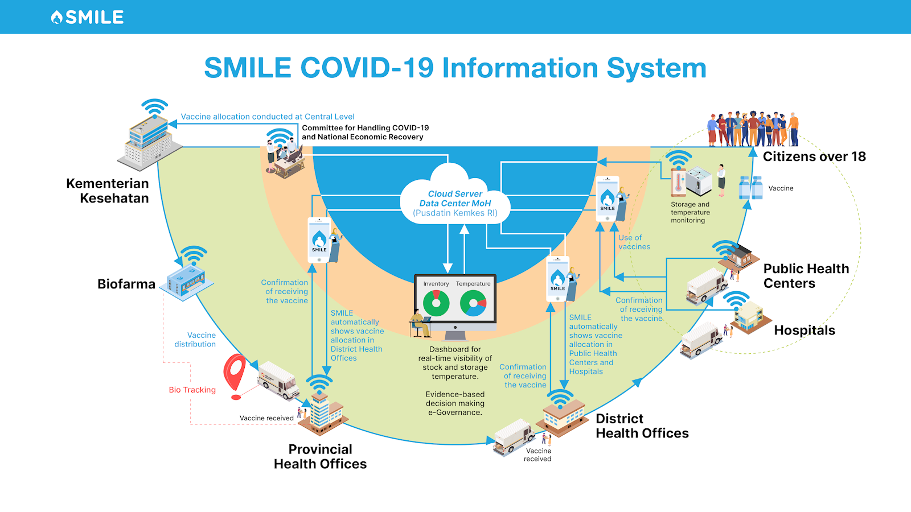

SMILE provides real-time information on all vaccine stocks, including actual storage temperatures. 
This data can be accessed via a web or application-based dashboard by programme managers at the district, 
provincial, and national levels. Trained cold chain handlers digitise all vaccine stocks through a smartphone 
application, with the data uploaded to a cloud server.

---

## Purpose of the Platform

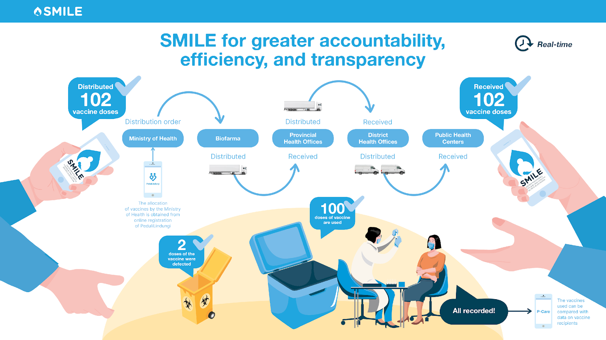
This application’s digital innovation includes a mobile application for cold chain handlers, a web interface 
that receives data from the app, a temperature logger to track vaccine storage temperatures, and a vaccine and 
cold chain manager to ensure that the product and procedures run smoothly. Health officials can use the analytics 
on the SMILE web interface to verify whether vaccinations are overstocked, falling short of the prescribed amounts,
or entirely out of stock. This facilitates governance and program management by making data available from even 
the most remote sites.

SMILE enhances operational efficiencies, lowers costs for government health providers, and addresses disparities 
in vaccine coverage. It integrates advanced technology, systematic record-keeping practices, and a network of trained 
personnel to aid health officials in tackling widespread inequities in vaccine distribution. By overcoming challenges 
related to infrastructure, monitoring and management information systems, and human resource constraints—which often lead 
to overstocking and stock-outs in storage facilities—SMILE supports evidence-based public health decisions by providing 
data freely to policymakers and decision-makers.

---

## Flow The Platform
This application’s have 4 main flow that support its use of the application for vaccine and medicine logistics. 
This main flow is Planning, Order, Distribution, and Disposal.

### Planning

The **Flow of Planning** for medicines, medical devices, and other health supplies through the SMILE system begins at 
the Regency/Municipal Health Office, which **prepares a needs planning that the needs proposed** by Community Health Centers 
and Hospitals. This planning data is then submitted to the Provincial Health Office for review and consolidation. 
After the Provincial Health Office completes its review, the consolidated planning is submitted to the Ministry of Health of the Republic of Indonesia.

At the national level, the Ministry of Health conducts a **desk verification** of the planning together with each Provincial Health Office.
This verification includes planning for medicines and logistics using the e-monev system. Once the verification process is completed, 
confirmation is provided, and all planning data is recorded in the SMILE system to ensure accuracy, transparency, and accountability.

### Order
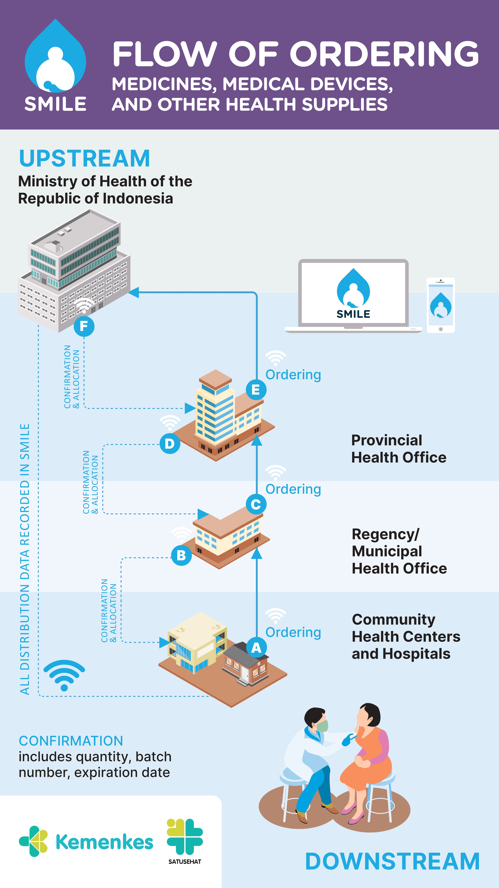
The **Flow of Ordering** medicines, medical devices, and other health supplies through the SMILE system begins at healthcare 
facilities such as Community Health Centers and Hospitals, which submit their **orders through the system**. These orders are
then forwarded to the Regency/Municipal Health Office for further **processing and confirms** the details, including quantity, 
batch number, and expiration date with **allocation order**. Subsequently, the orders are sent to the Provincial Health Office 
for verification and confirms with allocation order. After this step, the Provincial Health Office submits the orders to 
the Ministry of Health of the Republic of Indonesia. Once the orders are received, the Ministry of Health confirms and allocation order. 

After confirmation, Order is carried out according to the data recorded in the SMILE system. All ordering and 
distribution data are recorded in the SMILE system to ensure transparency, accuracy, and traceability.

### Distribution

The **Flow of Distribution** through the SMILE system begins when the Ministry of Health of the Republic of Indonesia to a **distribution order** to the 
**manufacturer or distributor**. The manufacturer or distributor then carries out the distribution of medicines, vaccines, and other logistics 
according to the order. Material data from the distribution process is **recorded in the DIN system and integrated with SMILE based on the KFA**.

Once the distribution is initiated, the Provincial Health Office **receives the supplies and records the distribution data** in SMILE. 
After confirmation, the supplies are further distributed to the Regency/Municipal Health Office, which also records the distribution data in SMILE. 
Finally, the supplies reach the Community Health Centers and Hospitals, where confirmation is provided regarding the quantity, 
batch number, and expiration date.

Throughout the process, all distribution data is documented in SMILE to ensure transparency, accuracy, and traceability. Additionally, 
SMILE tracks the amount of logistics and vaccines used, relocated, and those that have expired or been damaged.

### Disposal

The **Flow of Disposal** begins with the Ministry of Health of the Republic of Indonesia issuing a **distribution order to manufacturers and distributors**. 
Upon receiving the order, manufacturers and distributors distribute medicines, vaccines, and other health logistics as instructed, while recording 
material data based on the DIN system, which is integrated into the SMILE system.

Next, the distribution proceeds in stages. First, the items are delivered to the Provincial Health Office, then to the Regency/Municipal Health Office, 
and finally to community health centers and hospitals. At each stage, **distribution data is documented and recorded in the SMILE** system through 
SMILE Distribution Data.

Once the items reach health facilities, **documenting is carried out for medicines, vaccines, and logistics that cannot be used**. The recorded 
information includes quantity, batch number, and expiration date. This data is then entered into the SMILE system to ensure transparency. 
The SMILE system also records items that cannot be used and have been handed over to a third party for disposal.

---

## Target Audience
### Who is it for?
Health facility and Program managers at the public health centre, hospital, district, province, and national levels, as well as staff from Biofarma, as a vendor.

### What does it do?
Ensures proper storage and distribution of health service materials by tracking temperatures, monitoring stock levels, and providing real-time data information.

### Why use it? 
The benefits of SMILE include the following:
1. Informs policy and decision-making for immunisation supply chain management at all levels;
2. Develops standard operating procedures for systematic record-keeping of vaccine logistics to minimise human error in recording;
3. Facilitates maintenance of optimum vaccine stocks by reducing instances of vaccine wastage and stock-out;
4. Supervision and Minimisation of Excess Vaccine Stock;
5. Ensures quality and safety of vaccines through real-time information on storage temperature with the help of SIM-enabled temperature loggers;
6. Improves the efficiency of vaccine cold chain logistics management by introducing state-of-the-art technology for digitising vaccine stocks;
7. Strengthens the immunization system by empowering the human resources in districts

---

## Service
| **Service** | **Description** |
|------|------------------------|
| **Inventory** | Monitor stock levels, update product availability, and track supply chain logistics. |
| **Order** | Track and create stock movements by requesting or distributing it to other entity. |
| **Transaction** | Manage and record all stock movements while ensuring accurate inventory updates. |
| **Warehouse Inspection** | Ensuring alignment between stock movements and transactions recorded in the application with what actually happens. |
| **Asset** | Manage the assets owned by entities in the application to ensure stock quality and capacity are well monitored. |
| **Dashboard and Report** | View summarized information from the data stored in the application to support decision-making and for audit purposes. |
| **Disposal** | Manage and record disposal transaction in the application to process discard material by self or disposal instruction. |
| **Planning** | Manage and record annual planning stock material for distribution to entity  |

---

## Platform Availability
SMILE is accessible on both web and mobile platforms, and also on the API synchronisation with other external 
health care system with restricted access providing a seamless experience across devices. Accessing the platform 
can be differ by the role you are assigned to. For more information about the role that can access each platform, 
please refer to Role and Responsibilities page.
- **Web Platform**: Access the platform via a supported browser on Windows, macOS, or Linux;
- **Mobile Application**: Available for Android and iOS, ensuring accessibility on the go;
- **Synchronisation**: All data and functionality are consistent across web and mobile, allowing users to switch between devices effortlessly.

### Web Platform
You can directly use the application through your web browser by accessing the link below.
link : https://smile.kemkes.go.id/id/v5/login

### Mobile Platform
You need to download the application into your mobile device to use the application.

- **Android**
  - link : SMILE Health - Apps on Google Play 

- **iOS**
  - link : SMILE Health App - App Store 

---

## Accessing the Platform
### Minimum System Requirements
- Supported Browsers for Web Platform: 
   - Chrome 131.x;
   - Firefox 133.x;
   - Edge 133.x;
   - Safari 18.x.
- Mobile Compatibility for Mobile Application:
   - Android 10.x;
   - iOS 13.x.

### Logging In
#### Web Workflow
You can access the SMILE Platform through the link https://smile.kemkes.go.id/ in your browser. 
1. Open the SMILE 5.0 login page;
2. Fill in the credentials in the Username and Password field;
   
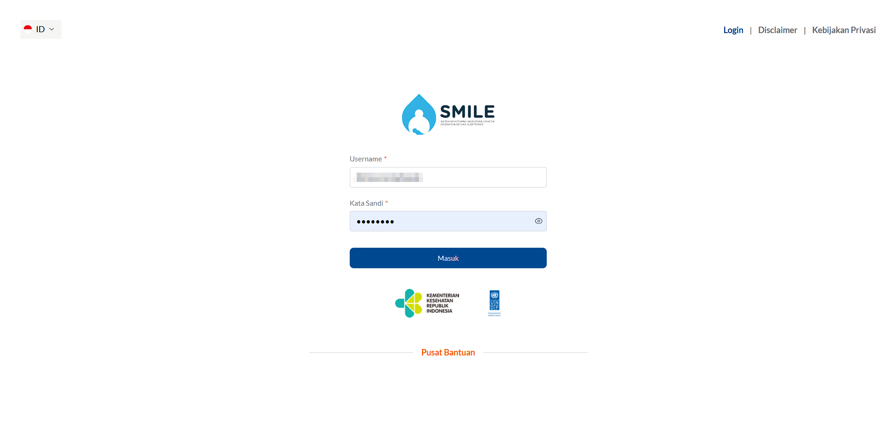

4. Click Login - this will display the program page that has been assigned and show a pop-up
message Login successful. Redirecting to the homepage.

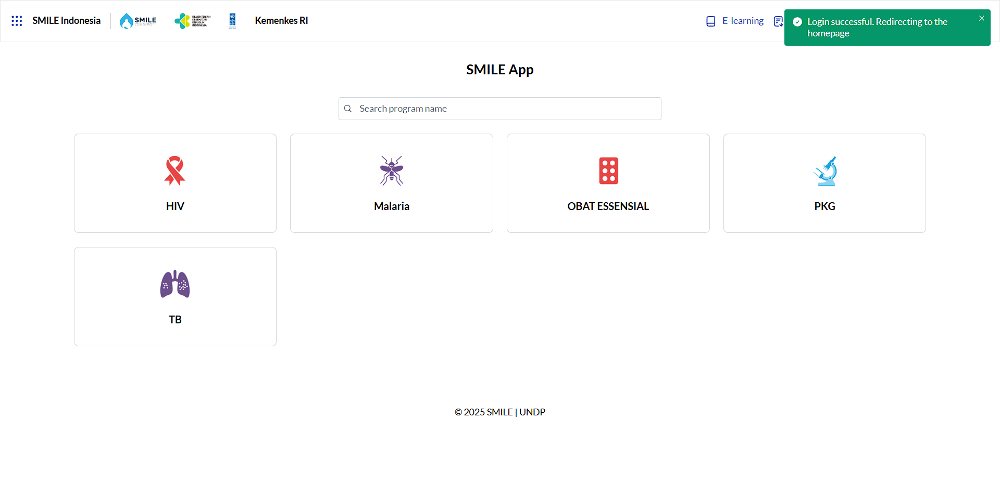

#### Mobile Workflow
You can access the app by downloading it at Play Store for Android or App Stor for iOS.
1. Open the SMILE app on the mobile device –  this will navigate to the login page;
2. Fill in the credentials in the Username and Password field;

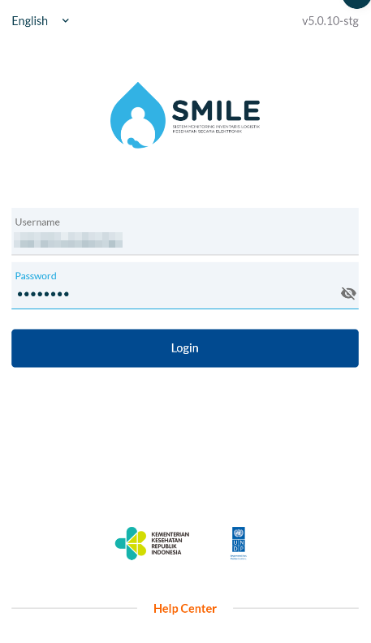

3. Click Login - this will display the program page that has been assigned and show a pop-up
   message Login successful.
   
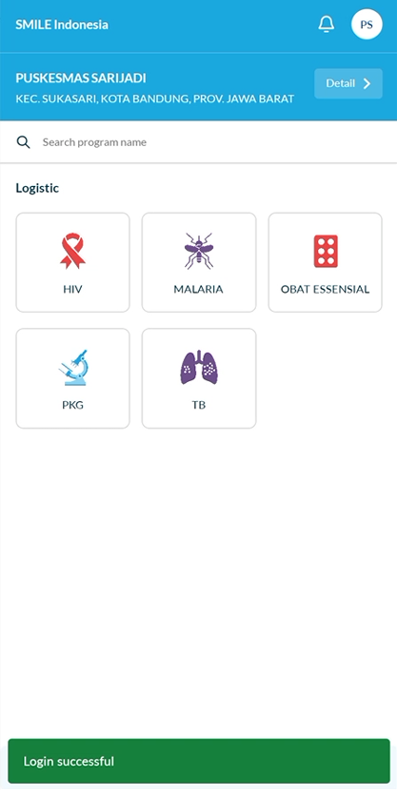

---

## Navgiating the Platform
### Web Application
#### Home Page
After logging in, you will see the **SMILE Programs**, which provide access to the 
programs that have been assigned to you.

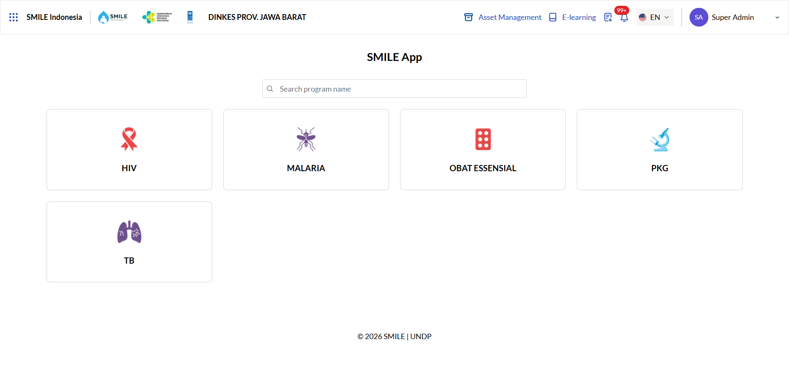

#### Global Navbar Overview
On top of the screen, you will see the Navbar, which provides quick access to:
1. **Sidebar**: This sidebar contains another access to the assigned programs for the current user;
2. **Logos**: Contains the logo of SMILE Application, Ministry of Health Indonesia, and UNDP Indonesia;
3. **Entity Name**: Provides information about the current user’s associated entity;
4. **Asset Management**: A management of asset owned by entity;
5. **SMILE E-Learning**: A learning platform with video courses to help users understand how to use
   SMILE and manage their programs. It's mainly used during training sessions;
6. **Export History**: A place to view and download export data files that have been requested by the current user.
7. **Notification**: Contains information related to changes that occur in inventory, orders, or transactions
   on the user’s associated entity;
8. **Language**: The Languages option is provided for users to use SMILE;
9. **Profile**: A dropdown for the user to perform profile-related actions, such as View Profile and Logout.

For Super Admin, there is also a **Global Setting** action menu in this dropdown.

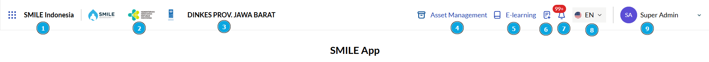

#### Sidebar Overview
Once you click the Dotted-box icon on the top left of the screen, it will be shown the list 
of programs that have been assigned to you.

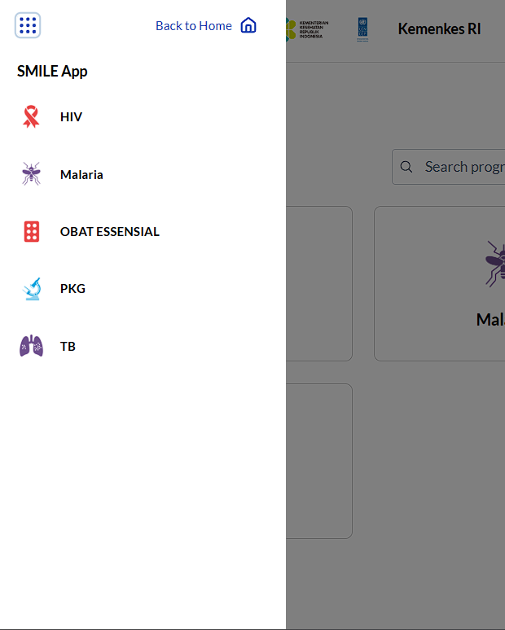

## Mobile Application
### Homepage
After logging in, you will see the SMILE Programs, which provide access to the programs 
that have been assigned to you.

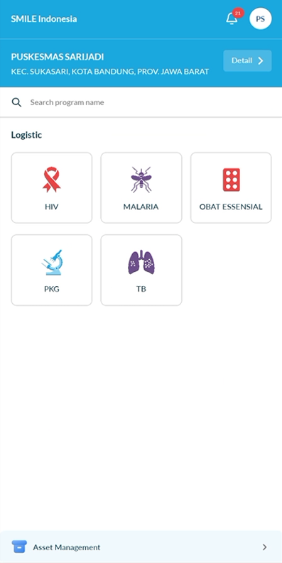

### Navbar Overview
On top of the screen, you will see the Navbar, which provides quick access to:
1. Notification: Contains information related to changes that occur in inventory,
   orders, or transactions on the user’s associated entity;
2. Profile Sidebar: This sidebar contains the current profile’s related information
   and other actions, iconed with current profile’s initial full name.
3. User’s Entity Information: Information about the current user’s profile associated entity;
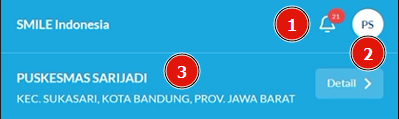

On bottom of the screen, you will see the Navbar, which provides quick access to:
1. Asset Management: Manage the assets owned by entities in the application to ensure stock quality and capacity are well monitored.

### Sidebar Overview
Once you click the Profile icon on the top right of the screen, it will be shown the profile-related information including:
1. **Profile Management**: Contain actions related to Profile Management, such as Edit Profile and Edit Password;
2. **Language**: A language option is provided for users to use SMILE;
3. **Application’s Version**: Information about current’s version of the application used;
4. **Logout**: Logs out of the system.

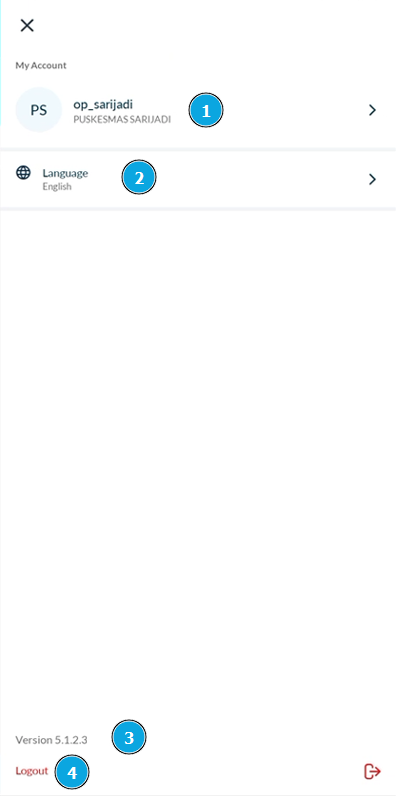

---

## Documentation Overview
In this section, you can view a curated list of essential resources and documentation designed to enhance your 
understanding and utilization of the SMILE platform. Each entry offers valuable insights, detailed instructions, 
and updates that are crucial for both new and experienced users. Whether you are seeking specific programme details, 
technical specifications, or the latest changes, this list serves as a comprehensive guide for effectively 
navigating the various aspects of the platform.
- Ministry of Health Healthcare System Overview
- System Data Architecture
- Database Tables Overview
- Role and Responsibilities
- API Documentation
- SMILE Services
- Glossary
- SMILE User Guide
- API Quick Start Guide
- Error Codes and Troubleshooting Guide
- Technical Overview Guide
- SMILE Cloud Infrastructure
- Data Streaming Mechanism
- Deployment and Installation Guide

---

## Using Core Feature
### How to View Stock on an Entity
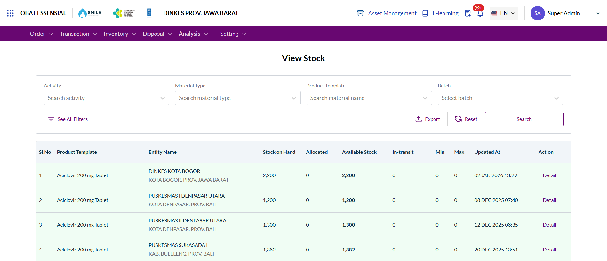

To perform this feature, follow these steps:
1. Log in to the SMILE system;
2. Select the desired Program;
3. Navigate to the **Analysis** menu - this will display the **Analysis** sub menu list;
4. Click the **Inventory** sub menu - this will display the Inventory List;
5. Click **Stock Detail** – this will display **Stock List**;
6. Apply the desired filter(s) –  this will filter the stock material list with applied filters;
7. Click **Search** –  this will display a list of stock material with the applied filters.

---

## Next Steps
- Explore the SMILE Knowledge Base to maximize your platform's potential;
- Go over each SMILE Services for in-depth instructions;
- Stay updated with the latest enhancements in our Changelog.
