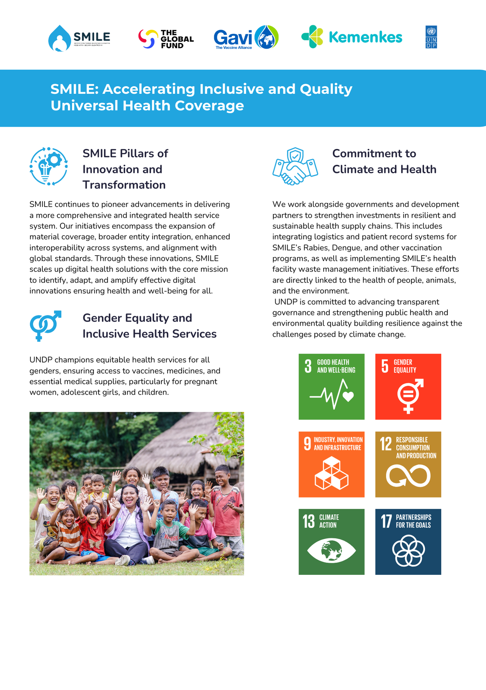

# Sustainable Development Goals  Alignment – SMILE

## About 
This document purpose to provide information about SMILE compliance to SDGs

## Overview

The Electronic Health Inventory and Logistics Monitoring System (SMILE) is a digital solution designed to strengthen national health 
supply chain systems through improved visibility, accountability, and efficiency. SMILE directly contributes to the achievement of 
the United Nations Sustainable Development Goals (SDGs) by supporting equitable access to essential health commodities, improving 
health system resilience, and enabling data-driven decision-making at national and subnational levels.

SMILE was developed and implemented in collaboration with the Indonesian Ministry of Health and United Nations Development Programme (UNDP), 
with a strong focus on sustainability, scalability, and public-sector ownership.

---

## SDG 3 – Good Health and Well-Being

**Primary SDG**

SMILE directly supports SDG 3 by ensuring the availability, quality, and equitable distribution of essential health commodities.

**Key contributions:**
- Improves availability of vaccines, medicines, and medical supplies  
- Reduces stock-outs, overstocking, and wastage  
- Monitors cold chain conditions to maintain vaccine efficacy  
- Supports national health programmes, including immunization, tuberculosis, HIV, malaria, rabies, and environmental health  
- Strengthens preparedness and response to public health emergencies  

---

## SDG 5 – Gender Equality

SMILE indirectly supports SDG 5 by strengthening health systems that serve women and girls.

**Key contributions:**
- Supports maternal and child health programmes through reliable vaccine and medicine supply  
- Improves access to essential health services for women in underserved and remote areas  
- Provides disaggregated logistics data that can support gender-sensitive health planning and policy formulation  

---

## SDG 9 – Industry, Innovation, and Infrastructure

SMILE supports SDG 9 by strengthening digital public infrastructure for health logistics.

**Key contributions:**
- Provides a scalable, cloud-based digital platform for national health supply chains  
- Enables interoperability with other health information systems  
- Promotes the adoption of modern, open, and reusable digital solutions in the public sector  

---

## SDG 12 – Responsible Consumption and Production

SMILE contributes to SDG 12 by promoting efficient and responsible management of health commodities.

**Key contributions:**
- Reduces wastage caused by expiration, damage, and temperature excursions  
- Improves inventory planning and forecasting  
- Supports tracking and reporting of medical and pharmaceutical waste  

---

## SDG 13 – Climate Action

SMILE indirectly supports SDG 13 by improving efficiency and reducing environmental impact in health logistics.

**Key contributions:**
- Reduces unnecessary transportation through better planning and real-time stock visibility  
- Minimizes waste of temperature-sensitive products  
- Supports more efficient use of cold chain and logistics infrastructure  

---

## SDG 17 – Partnerships for the Goals

SMILE strongly aligns with SDG 17 through multi-stakeholder collaboration and global reuse.

---

## Summary

SMILE contributes most directly to **SDG 3**, while also supporting **SDGs 5, 9, 12, 13, and 17** through strengthened health systems, digital public infrastructure, responsible resource management, environmental efficiency, and international collaboration.
