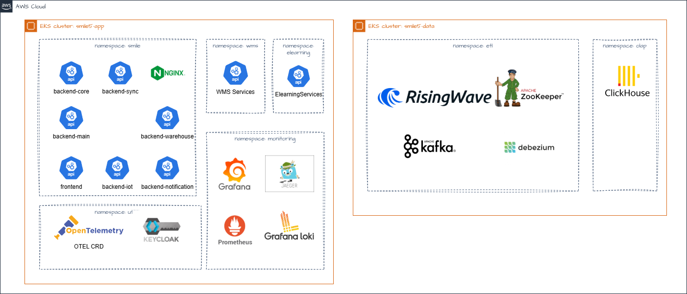

# SMILE Cloud Infrastructure

## Table of Contents
- [About](#about)
- [Cloud Infrastructure](#cloud-infrastructure)
- [Environment Structure](#environment-structure)
- [Infrastructure Requirements](#infrastructure-requirements)
  - [Application Requirements](#application-requirements)
  - [Data Analysis Requirements](#data-analysis-requirements)
  - [Other Resources Requirements](#other-resources-requirements)
- [Architecture Diagram](#architecture-diagram)
- [Network Architecture](#network-architecture)
- [Compute Resources](#compute-resources)
  - [Kubernetes Clusters (EKS)](#kubernetes-clusters-eks)
    - [Application Cluster](#application-cluster)
    - [Data Cluster](#data-cluster)
  - [EC2 Instances](#ec2-instances)
- [Database Services](#database-services)
  - [MySQL RDS Instances](#mysql-rds-instances)
- [Messaging & Caching](#messaging--caching)
- [Storage](#storage)
- [Container Registry](#container-registry)
- [Supporting AWS Services](#supporting-aws-services)
- [Security & Access](#security--access)
- [Monitoring & Observability](#monitoring--observability)
- [Traffic & CI/CD Flow](#traffic--cicd-flow)

---

## About

This document provides a comprehensive architectural overview of the **SMILE application cloud infrastructure** and deployment strategy across **Development, Staging, and Production** environments.

SMILE is deployed on **Amazon Web Services (AWS)** in the **Jakarta Region (ap-southeast-3)** and uses **Amazon EKS (Kubernetes)** for container orchestration.

It describes:
- Environment structure and purpose
- Key AWS services
- Kubernetes namespace segregation
- CI/CD workflows
- Traffic routing
- Observability tooling
- Security configurations

The objective is to provide a clear understanding of how SMILE is deployed, maintained, and monitored within a **scalable, secure, and automated cloud-native ecosystem**.

---

## Cloud Infrastructure

- **Cloud Provider:** AWS  
- **Region:** ap-southeast-3 (Jakarta)  
- **Orchestration:** Amazon EKS (Elastic Kubernetes Service)  
- **Data Layer:** Amazon RDS, Kafka, Debezium, RisingWave, Pentaho  
- **Security & Networking:** VPC, NAT Gateway, Bastion Host, Route 53, Cloudflare  

---

## Environment Structure

| Environment | Purpose | Deployment Target | Notes |
|------------|--------|-------------------|-------|
| Dev | Developer testing and previews | AWS Cloud / Ephemeral EKS or shared Dev cluster | May share infrastructure; automated deployment from feature branches |
| Staging | Pre-production testing, QA, validation | `*-uat` clusters on AWS (EKS, RDS, etc.) | Mirrors production for testing |
| Production | Live workloads | Fully isolated AWS infrastructure | High availability, security-hardened, scalable |

---

## Infrastructure Requirements

The following requirements apply to deployments in **Indonesia**. Specifications may vary for other countries.

---

### Application Requirements

| Resource | Qty | Details | Comments |
|-------|-----|--------|---------|
| Amazon ECR | 1 | 1TB storage, 1TB transfer | |
| EKS Cluster (Application) | 1 | EKS Cluster | |
| Amazon EC2 | 5 | m6g.2xlarge, 8 vCPU, 32 GiB RAM, 200GB disk | Hosted on Application EKS |
| Amazon RDS | 1 | db.m5.4xlarge, 16 vCPU, 64 GiB RAM, 1TB | Shared for App & Data |
| Amazon ElastiCache | 1 | cache.m5.xlarge | AWS managed |
| Amazon MQ | 1 | mq.m5.large | |
| Amazon ALB | 4 | Application Load Balancer | |
| Amazon API Gateway | 1 | API Gateway | Not in use initially |
| AWS Secrets Manager | 10 | Secrets storage | |
| Amazon EC2 | 2 | m6g.2xlarge, 8 vCPU, 32 GiB RAM, 200GB | WMS estimation |
| Amazon RDS | 1 | db.m5.2xlarge | WMS estimation |

---

### Data Analysis Requirements

| Resource | Qty | Details | Comments |
|-------|-----|--------|---------|
| Amazon RDS (OLTP – MySQL) | 1 | Shared RDS instance | |
| EKS Cluster (Data) | 1 | | |
| ClickHouse (OLAP) EC2 | 5 nodes | d3en.2xlarge, 8 vCPU, 32 GiB RAM | Hosted on Data EKS |
| Kafka EC2 | 3 nodes | d3en.2xlarge, 8 vCPU, 32 GiB RAM, 3TB | Hosted on Data EKS |
| Zookeeper EC2 | 3 nodes | d3en.2xlarge, 8 vCPU, 32 GiB RAM, 3TB | Hosted on Data EKS |
| Pentaho ETL EC2 | 1 node | t3.2xlarge or m5.2xlarge, 8 vCPU, 32 GiB RAM, 250GB | Hosted on Data EKS |

---

### Other Resources Requirements

| Resource | Quantity | Details | Comments |
|--------|----------|--------|---------|
| Security Hub | 1 | N/A | |
| AWS Config | 1 | N/A | |
| CloudTrail | 1 | N/A | |
| GuardDuty | 1 | N/A | |
| CloudWatch | 1 | N/A | |
| AWS Backup | 1 | N/A | |
| S3 Buckets | - | - | |
| Route 53 | 1 | - | DNS records |
| Bastion Host + SSM | - | t3.large | |
| Git Repository Server | 1 | t3.xlarge (4 vCPU / 16GB) | Shared across environments |

---

## Architecture Diagram

---

## Network Architecture

- **VPC:** Single VPC (CIDR `10.0.0.0/16`)
- **Subnets:**
  - EC2 Private (general compute)
  - EKS Private (Kubernetes workloads)
  - Intra (internal services)
  - Public (internet-facing)
- **NAT Gateway:** Outbound internet access
- **VPC Flow Logs:** Stored in S3 for monitoring

---

## Compute Resources

### Kubernetes Clusters (EKS)

SMILE operates **two separate EKS clusters**.

#### Application Cluster
- **Purpose:** Runs application services
- **Node Types:**
  - Main app nodes: ARM-based `m6g.2xlarge`
  - WMS nodes: ARM-based `m6g.xlarge`

#### Data Cluster
- **Purpose:** Data processing workloads
- **Node Types:**
  - OLAP processing: `d3en.2xlarge`
  - Kafka messaging: `d3en.2xlarge`
  - Zookeeper: `d3en.2xlarge`
  - ETL: `t3.2xlarge`
  - ClickHouse: `d3en.2xlarge`

---

### EC2 Instances

- **Bastion Host**
  - Instance type: `t3.small`
  - Purpose: Secure SSH access to private resources

---

## Database Services

### MySQL RDS Instances

| Database | Engine | Size | Backups |
|--------|--------|------|---------|
| Main Application | MySQL 8.0 | db.m5.4xlarge, 500GB | Daily, 7-day retention |
| Waste Management System | MySQL 8.0 | db.m5.xlarge, 200GB | Daily, 7-day retention |

---

## Messaging & Caching

| Service | Purpose | Version | Instance |
|-------|---------|---------|----------|
| Amazon MQ (RabbitMQ) | Messaging & events | 3.13 | mq.m5.large |
| ElastiCache (Redis) | Caching & sessions | 6.2 | cache.m5.xlarge |

---

## Storage

**Amazon S3 Buckets**
- Application data
- Network flow logs (30-day retention)
- Observability data (Loki, Tempo)

---

## Container Registry

**Amazon ECR repositories** for:
- Backend services (core, main, platform, auth, sync, warehouse)
- Frontend web application
- WMS services (backend, frontend, mobile, BFF)

**Lifecycle policy:** Untagged images removed after 14 days.

---

## Supporting AWS Services

- Amazon RDS – relational data storage
- Amazon EKS – Kubernetes cluster
- Amazon ElastiCache – caching
- Amazon MQ – message broker
- Amazon S3 – object storage
- AWS Secrets Manager – credentials & secrets
- AWS Backup – backup services

---

## Security & Access

- Cloudflare – DNS and edge security
- Route 53 – routing
- Bastion Host – access gateway
- NAT Gateway – outbound access
- Security Groups – least privilege
- IAM – infrastructure access control
- Secrets Manager – secure credentials
- WAF – application protection

---

## Monitoring & Observability

- Prometheus + Grafana – metrics & dashboards
- Jaeger – tracing
- Loki – log aggregation
- OpenTelemetry Collector – unified telemetry

---

## Traffic & CI/CD Flow

1. **External traffic:** Cloudflare → Route 53 → Load Balancer → EKS (via Istio)
2. **Internal traffic:** Secure service-to-service communication via Istio
3. **CI/CD Pipeline:**
   - GitLab – source code management
   - Jenkins – build & deployment automation

---

