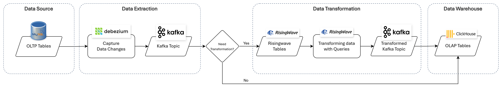

# Data Streaming Mechanism

## Table of Contents
- [About](#about)
- [Technology Stack](#technology-stack)
- [Step-by-step Guide](#step-by-step-guide)
  - [Using Kubernetes](#using-kubernetes)
- [Data Pipeline](#data-pipeline)
  - [Data Source (MySQL)](#data-source-mysql)
  - [Data Extraction (Kafka)](#data-extraction-kafka)
  - [Data Transformation (RisingWave)](#data-transformation-risingwave)
  - [Data Warehouse (ClickHouse)](#data-warehouse-clickhouse)
- [Performance Overview](#performance-overview)

---

## About

This document provides technical implementation guidance for building a **real-time data streaming pipeline** that integrates **MySQL, Debezium, Kafka, RisingWave, and ClickHouse** to enable continuous data flow from **OLTP to OLAP systems** within the **SMILE platform**, particularly for **Dashboard and Report services**.

The document outlines:
- Best practices  
- Configuration approaches  
- Operational considerations  

It is intended to support both **initial setup** and **ongoing maintenance** of the pipeline in **containerised environments**.

---

## Technology Stack

- **MySQL Database**  
  Acts as the source OLTP database. Must be configured to allow CDC (binary log enabled).

- **Kafka Connect with Debezium**  
  Captures real-time data changes (INSERT, UPDATE, DELETE) from MySQL and streams them into Kafka topics.

- **Kafka**  
  Serves as the message broker to receive and forward change events.

- **RisingWave**  
  Processes and transforms streamed data. Reads data from Kafka topics, applies transformations, and outputs to other Kafka topics.

- **ClickHouse Database**  
  Serves as the target OLAP database. Requires table definitions compatible with Kafka message formats.

---

## Step-by-step Guide

### Using Kubernetes

To implement the data streaming pipeline for SMILE, follow these steps:

1. Run **MySQL, ClickHouse, Debezium (Kafka Connect), Kafka, and RisingWave** using Kubernetes operators.  
   - For Kafka and Kafka Connect, the **Strimzi Operator** is recommended.

2. Create the **Debezium connector configuration** in YAML.  
   - It is recommended to create **one connector for multiple tables** rather than one per table to reduce resource usage.

3. Apply the connector configuration to Kubernetes.

4. Create **RisingWave tables** to:
   - Read data from Kafka topics  
   - Apply transformations  
   - Output results to new Kafka topics

5. Create **ClickHouse tables** to capture data from Kafka topics.  
   - Data types must be compatible with Kafka message formats.

6. Create **ClickHouse Sink Connector** configurations to stream data from Kafka topics into ClickHouse tables and apply them in Kubernetes.

7. Create **materialised views** in ClickHouse if additional processing is required.

8. (Optional) Create additional ClickHouse tables as needed to support analytical workloads.

---

## Data Pipeline

### Data Source (MySQL)

- **Source Database**  
  A transactional MySQL database serves as the source system. Tables are monitored using CDC.

- **Change Data Capture (CDC)**  
  Debezium captures row-level changes (INSERT, UPDATE, DELETE) from MySQL in real time.

- **Configuration**
  - Connector class: `io.debezium.connector.mysql.MySqlConnector`
  - Key configurations:
    - `database.hostname`
    - `database.include.list`
    - `table.include.list`
    - `snapshot.mode` (e.g. `initial`, `when_needed`)

---

### Data Extraction (Kafka)

- **Topic Design**  
  Partitioning strategies typically use primary keys or unique identifiers to ensure balanced distribution.

- **Message Format**  
  Data is serialised in **JSON** format. A **Schema Registry** is used to manage schema evolution.

- **Retention & Replay**
  - Topics are configured with time-based or size-based retention.
  - Consumer groups can reset offsets to support historical replay and backfill.

---

### Data Transformation (RisingWave)

After data enters Kafka, transformation requirements are evaluated:

- **No Transformation Required**
  - Kafka topics are streamed directly into ClickHouse.

- **Transformation Required**
  - Kafka topics are ingested into RisingWave for processing.

#### Transformation Logic

RisingWave supports SQL-based stream processing, enabling:
- Field renaming or mapping
- Data enrichment (e.g. joins with reference data)
- Business rule application (e.g. currency conversion, aggregation)
- Filtering or conditional routing

#### Configuration & Workflow
- Transformations are defined using SQL statements.
- Materialised views are created in RisingWave.
- These views can be published as new Kafka topics.

#### Performance Considerations
RisingWave performance can be tuned via:
- Batch window settings
- Operator parallelism
- Backpressure handling and resource utilisation

---

### Data Warehouse (ClickHouse)

- **Destination Database**  
  ClickHouse serves as the final OLAP storage layer. Tables are optimised for analytical queries and are not direct 1:1 copies of MySQL tables.

- **Write Strategy**
  - Both direct Kafka topics and transformed Kafka topics are ingested into ClickHouse.
  - Table engine: `ReplicatedReplacingMergeTree`

---

## Performance Overview

### Performance Benchmarks

- **Debezium Sink (MySQL → Kafka)**
  - Rows per second
  - Bytes per second

- **ClickHouse Sink (Kafka → ClickHouse)**
  - Rows per second
  - Bytes per second

- **RisingWave Processing**
  - Rows per second processed through transformation pipelines

### Bottlenecks

- Kafka storage during one-time bulk loads
- RisingWave resource usage during heavy JOIN operations
- Requirement for full reload when sink connector configuration changes
- Memory limit errors under high concurrent dashboard usage

### Scaling Strategies

- Horizontal Pod Autoscaling for RisingWave
- Vertical scaling for ClickHouse and Kafka Connect (including Debezium)

---

